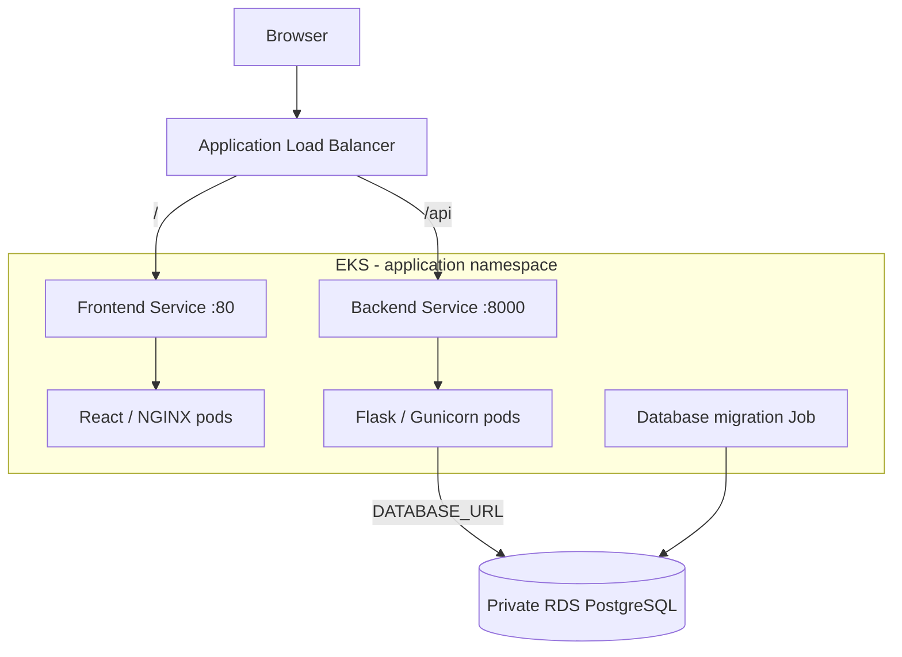

# Three-Tier DevOps Application on AWS EKS

My hands-on AWS and Kubernetes project for running a React frontend, a Flask API, and a PostgreSQL database. I use a DevOps quiz application as the workload to practice containerization, infrastructure as code, Kubernetes networking, database initialization, and CI automation.

This repository brings together my environment-specific Terraform configuration, Kubernetes manifests, Docker image references, and GitHub Actions workflows. It documents a learning implementation; the configuration includes lab defaults and unfinished automation, so it is not a production-ready deployment.

**Maintained by:** [mreddi8997](https://github.com/mreddi8997)

## Project focus

The implementation in this repository covers:

- **Infrastructure as code:** Terraform definitions for a VPC, public and private subnets, NAT routing, an EKS managed node group, and a private RDS PostgreSQL instance.
- **Container packaging:** a multi-stage React/NGINX image and a Python/Flask image served by Gunicorn.
- **Kubernetes deployment:** separate frontend and backend Deployments and ClusterIP Services, rolling updates, resource requests and limits, and frontend health probes.
- **Application routing:** an internet-facing ALB Ingress that routes `/api` to Flask and `/` to the frontend.
- **Database setup:** a Kubernetes Job that runs Flask migrations and conditionally seeds sample data.
- **Scaling configuration:** CPU-based HorizontalPodAutoscalers for both application tiers.
- **CI and infrastructure checks:** GitHub Actions definitions for image builds, Docker Hub publishing, Trivy scans, Terraform validation, TFLint, and Checkov.

These are repository-backed implementation details, not claims of current AWS availability or measured production performance.

## Architecture



The infrastructure is configured for **us-east-2**, with an EKS cluster named `my-eks-cluster`. Terraform places managed EC2 worker nodes in private subnets and RDS in dedicated database subnets across two Availability Zones. A single NAT gateway provides outbound routing for the worker subnets.

The top-level manifests use the namespace `3-tier-app-eks` and the Docker Hub images `mreddi8997/my-frontend` and `mreddi8997/my-backend`. Both Deployments start with two replicas; the HPAs specify 2–10 replicas at a 70% CPU utilization target.

An `ExternalName` Service named `postgres-db` is included for RDS DNS discovery. The current backend connection string points directly to the RDS hostname, while its init container checks the Service DNS name.

## Application

The sample application provides topic browsing, quizzes, a results view, individual question entry, and CSV question uploads. The backend stores topics and questions through SQLAlchemy. Quiz retrieval selects up to 15 questions and shuffles answer options.

| Endpoint | Purpose |
| --- | --- |
| `GET /api` | API health response |
| `GET /api/topics` | List quiz topics |
| `POST /api/topics` | Create a topic |
| `GET /api/quiz/<topic_slug>` | Retrieve a quiz |
| `POST /api/quiz/submit` | Submit answers for scoring |
| `GET /api/quiz/questions` | List questions |
| `POST /api/quiz/questions` | Add a question |
| `POST /api/quiz/questions/bulk` | Import questions as JSON, including CSV data parsed by the UI |

Sample CSV files for AWS, Docker, Kubernetes, Linux, and Jenkins are in [questions-answers](3-tier-app-eks/backend/questions-answers).

## Repository layout

| Path | Contents |
| --- | --- |
| [3-tier-app-eks/frontend](3-tier-app-eks/frontend) | React UI, API configuration, NGINX configuration, and Dockerfile |
| [3-tier-app-eks/backend](3-tier-app-eks/backend) | Flask routes, models, migrations script, seed data, and Dockerfile |
| [3-tier-app-eks/infra](3-tier-app-eks/infra) | Terraform networking, EKS, RDS, provider, outputs, and S3 state backend |
| [K8s](K8s) | Environment-specific application manifests used as the main deployment reference |
| [.github/workflows](.github/workflows) | Frontend, backend, and infrastructure workflow definitions |
| [3-tier-app-eks/k8s](3-tier-app-eks/k8s) | Additional/reference manifests and setup notes, including monitoring and TLS examples |
| [3-tier-app-eks/docker-compose.yml](3-tier-app-eks/docker-compose.yml) | Local Compose configuration requiring the adjustments described below |

The two Kubernetes directories contain different configurations. Use the top-level `K8s/` files consistently for this environment rather than applying both directories together.

## CI and image publishing

| Workflow | What the checked-in configuration does |
| --- | --- |
| [frontend.yml](.github/workflows/frontend.yml) | Runs manually through `workflow_dispatch`; installs dependencies, attempts frontend tests, builds and scans an image, and pushes `my-frontend:latest` to Docker Hub. Test failures are allowed to continue. |
| [backend.yml](.github/workflows/backend.yml) | Defines dependency installation, image builds, scanning, and Docker Hub publishing for `my-backend:latest`. It currently has no `on` trigger, and its test step only prints a success message. |
| [infra.yml](.github/workflows/infra.yml) | Runs manually, assumes an AWS role through GitHub OIDC, initializes and validates Terraform, and runs lint/security tools. **Its final step currently executes `terraform destroy -auto-approve` with `if: always()`, despite being named “Terraform apply.”** |

Docker Hub publishing uses the repository secrets `DOCKER_USERNAME` and `DOCKER_PASSWORD`. AWS authentication references an environment-specific IAM role whose trust and permissions must already be configured.

Trivy findings are non-blocking in these workflows; TFLint uses `--force`, and Checkov uses `soft_fail: true`. The workflows do not implement automatic Kubernetes application deployment. ECR publishing, sequential version tags such as `v1`/`v2`, and a Jenkins pipeline are not implemented in this repository.

## Deployment preparation

This is a configuration-led lab rather than a one-command installer. Before recreating the environment:

1. **Review Terraform settings.** Replace the S3 state bucket and other environment-specific values in [infra](3-tier-app-eks/infra). The state bucket must exist before initialization. Review the pinned EKS and PostgreSQL versions for your target environment.
2. **Prepare cluster integrations.** Install/configure the AWS Load Balancer Controller and its IAM role, OIDC trust, and service account. Review subnet discovery tags. HPA operation also requires a working resource metrics API.
3. **Align database configuration.** Replace the RDS endpoint in `K8s/rds-service.yml` and `K8s/configmap.yml`. Supply fresh database credentials and a secret key outside source control. Keep `DATABASE_URL`, `DB_HOST`, `DB_NAME`, and the migration credentials consistent: the checked-in ConfigMap names `mydb1`, but the connection URL selects `postgres`.
4. **Prepare the frontend build.** Set the API base URL to `/api` during the React build for same-origin ALB routing. The source currently falls back to an environment-specific ALB hostname without the API prefix. Setting `REACT_APP_API_URL` only on the running NGINX container does not rebuild the static bundle.
5. **Review lab defaults.** Restrict the broad security-group rules, replace committed credentials, and review the limitations below before provisioning resources.

After those changes, initialize and review Terraform locally from `3-tier-app-eks/infra` using `terraform init`, `terraform validate`, and `terraform plan`. Apply only a reviewed plan. Do not use the current infrastructure workflow as a provisioning shortcut: it is configured for destruction.

For the application, use this order:

1. Create the namespace.
2. Configure the RDS Service, ConfigMap, and database Secret.
3. Run the migration Job and inspect its logs before starting the application.
4. Apply the backend and frontend Deployments/Services.
5. Apply the application Ingress and, once metrics are available, the HPAs.

Build and publish your own images before updating the manifest image references. The migration Job should use the same backend image version as the backend Deployment.

## Validation and troubleshooting

Once deployed, these commands inspect the application without changing infrastructure:

```bash
kubectl get deployments,pods,services -n 3-tier-app-eks
kubectl get ingress,hpa -n 3-tier-app-eks
kubectl rollout status deployment/backend -n 3-tier-app-eks
kubectl rollout status deployment/frontend -n 3-tier-app-eks
kubectl logs job/database-migration -n 3-tier-app-eks
kubectl logs deployment/backend -n 3-tier-app-eks
```

The migration Job has a short cleanup TTL, so collect its logs promptly. Check `/api` for the API health response and `/api/topics` to exercise database access. Then verify topic loading, a complete quiz submission, and a CSV upload in the UI. Successful pod startup alone does not confirm the full application flow.

For database failures, compare the Secret connection URL with the migration settings and check network access to RDS. For missing ALB routing, inspect the Ingress events and AWS Load Balancer Controller logs.

## Current limitations and next improvements

- **Security and data protection:** the repository contains plaintext lab credentials, broad inbound security-group rules, permissive CORS, and unauthenticated management endpoints. Replace credentials before reuse; rotate any that were used in a real environment. RDS backups and deletion protection are disabled, and final snapshots are skipped.
- **Frontend and local development:** the NGINX upstream uses Kubernetes-only DNS and its proxy path needs review against Flask's `/api` routes. Docker Compose therefore needs a local upstream configuration, a correctly built API URL, and explicit database initialization before it can serve as a reliable local startup path.
- **Quiz correctness:** retrieval shuffles answer options, while submission compares against stored answer indexes. This needs correction and end-to-end tests before quiz scores can be relied on.
- **Release automation:** add real backend tests, enforce meaningful test/scan gates, restore the backend workflow trigger, separate infrastructure provisioning from teardown, and adopt immutable versioned image references.
- **Operational readiness:** add backend readiness/liveness probes, reviewed migration history, and deployment verification. The repository includes Prometheus/Grafana setup and TLS/DNS reference files, but these do not establish that monitoring, HTTPS, or a custom domain is active in this environment.
